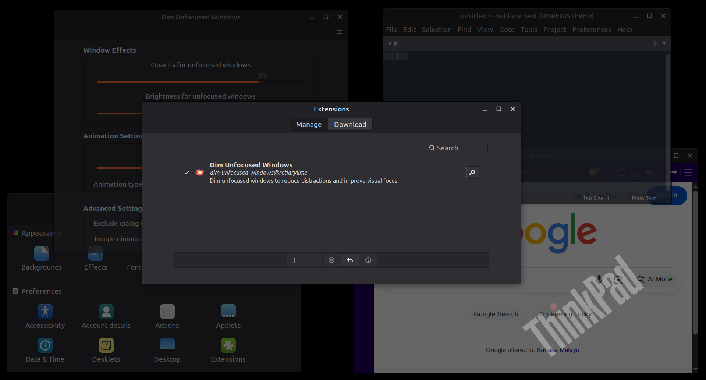

# Save Cinnamon Session

A Cinnamon extension that automatically saves window positions and applications on logout/shutdown and restores them on login to maintain your workspace state across sessions.



## Features

1. **Automatic Session Saving**: Automatically saves your current session (windows, positions, applications) when logging out or shutting down
2. **Automatic Session Restoration**: Restores your saved session when logging in, bringing back your applications and window layouts
3. **Smart Application Handling**: Launches saved applications and positions their windows in the correct locations and workspaces
4. **Workspace Preservation**: Maintains workspace assignments and switches to the previously active workspace
5. **Configurable Delays**: Adjustable restore delay to ensure desktop is fully loaded before restoration begins
6. **Application Filtering**: Exclude specific applications from being saved/restored (system apps, etc.)
7. **Manual Controls**: Keyboard shortcuts for manual session save and restore operations
8. **Maximized/Minimized State**: Preserves window states including maximized and minimized windows

## Requirements

This extension requires Cinnamon 4.0 or better.

## Installation

<!-- This extension is available on Cinnamon Spices. It can be installed directly from within Cinnamon using the "Extensions" application under the "System Settings".

[Save Cinnamon Session on Cinnamon Spices](https://cinnamon-spices.linuxmint.com/extensions/view/XXX) -->

For the latest development version, follow these instructions to install manually:

1. Clone the repository (or download the latest release by clicking the green "Code" button above, then "Download ZIP")
   
   ```
   git clone https://github.com/retiarylime/save-cinnamon-session.git
   ```

2. If you downloaded a ZIP, extract it into a directory of your choice
   
   ```
   unzip ~/Downloads/save-cinnamon-session-main.zip
   ```

3. Change directory to the cloned repository or extracted ZIP file

4. Copy or link the "save-cinnamon-session@retiarylime" directory into the "~/.local/share/cinnamon/extensions/" directory
   
   ```
   cp -r $PWD/files/save-cinnamon-session@retiarylime ~/.local/share/cinnamon/extensions/
   ```

5. Open the Cinnamon Extensions application (Menu → Preferences → Extensions)

6. Find "Save Cinnamon Session" in the list and click the "+" button to enable it

7. Click the settings (gears) icon to open the settings panel and configure your preferences

## Settings

### General Settings
- **Auto-save session on logout/shutdown**: Automatically save the current session when logging out or shutting down
- **Auto-restore session on login**: Automatically restore the saved session when logging in
- **Restore delay**: Time to wait before restoring session (1-30 seconds, default: 3 seconds)

### Application Settings
- **Excluded applications**: Comma-separated list of applications to exclude from session saving (default excludes system applications)

### Keyboard Shortcuts
- **Manual save session**: Keyboard shortcut to manually save the current session (default: Super+Shift+S)
- **Manual restore session**: Keyboard shortcut to manually restore the saved session (default: Super+Shift+R)

## How It Works

The extension monitors your Cinnamon session and:

1. **On Logout/Shutdown**: 
   - Captures all open windows and their properties (position, size, workspace, state)
   - Records which applications are running
   - Saves this information to `~/.cinnamon-session-save.json`

2. **On Login**: 
   - Reads the saved session data
   - Launches the previously running applications
   - Waits for applications to start, then positions windows correctly
   - Restores workspace assignments and window states
   - Switches to the previously active workspace

## Session Data

The extension saves session data to `~/.cinnamon-session-save.json` which includes:
- Window positions, sizes, and states (maximized/minimized)
- Application identifiers and window titles
- Workspace assignments
- Active workspace information
- Timestamp of when the session was saved

## Limitations

1. **Application Launch**: Some applications may not launch properly via command line or may have different window titles when restored
2. **Timing Dependencies**: Window positioning depends on applications starting in a reasonable time frame
3. **Application Identification**: Some applications may not be properly identified or may change their identifiers
4. **System Applications**: System applications and special windows are intentionally excluded from session saving
5. **Multi-Monitor**: Multi-monitor setups may require additional configuration or manual adjustment

## Troubleshooting

**Extension not saving/restoring sessions:**
- Check if the extension is enabled in Settings → Extensions
- Look for error messages in `~/.xsession-errors` or run `journalctl -f` while testing
- Verify that the session file `~/.cinnamon-session-save.json` is being created

**Applications not launching during restore:**
- Check that the applications are installed and available in PATH
- Some applications may need to be launched differently (check excluded applications list)
- Increase the restore delay if applications need more time to start

**Windows not positioning correctly:**
- Increase the restore delay to give applications more time to fully load
- Some applications may not support programmatic window positioning
- Check that window titles haven't changed between save and restore

**Session file not found:**
- Ensure auto-save is enabled and you've logged out at least once since enabling the extension
- Check file permissions on your home directory
- Try manually saving a session using the keyboard shortcut

## Manual Session Management

You can manually save and restore sessions using the configured keyboard shortcuts:
- **Save**: Super+Shift+S (default) - Saves current session immediately
- **Restore**: Super+Shift+R (default) - Restores saved session immediately

## Privacy & Data

All session data is stored locally in your home directory (`~/.cinnamon-session-save.json`). No data is transmitted externally. The session file contains:
- Application names and window titles
- Window positions and sizes
- Workspace information

## Feedback

Feel free to open an [issue](https://github.com/retiarylime/save-cinnamon-session/issues) on this [GitHub repository](https://github.com/retiarylime/save-cinnamon-session) if you want to make a suggestion or report a problem.

If you like this Cinnamon extension, "star" this GitHub repository to encourage continued development. Thanks!

## Credits

This extension was developed following Cinnamon extension development best practices and utilizes the standard Cinnamon APIs for window management, session handling, and application launching.

## License

This extension is released under the GPLv3 License. See the [LICENSE](LICENSE) file for details.

## Contributing

Contributions are welcome! Please feel free to submit issues, feature requests, or pull requests.

## Changelog

### Version 1.0.0 - Initial Release

#### Added
- ✅ **NEW** - Automatic session saving on logout/shutdown
- ✅ **NEW** - Automatic session restoration on login
- ✅ **NEW** - Window position and size preservation
- ✅ **NEW** - Workspace assignment restoration
- ✅ **NEW** - Application launching and window positioning
- ✅ **NEW** - Configurable restore delay
- ✅ **NEW** - Application exclusion list
- ✅ **NEW** - Manual save/restore keyboard shortcuts
- ✅ **NEW** - Maximized and minimized state preservation
- ✅ **NEW** - Multi-workspace support
- ✅ **NEW** - Session data persistence via JSON file

#### Technical Features
- Uses native Cinnamon APIs for window management and session handling
- Implements proper extension lifecycle (init, enable, disable)
- Smart application identification and launching
- Robust error handling and logging
- Compatible with Cinnamon 4.0 through 6.2
- Follows Cinnamon extension development best practices

#### Verified Working
- ✅ Session saving captures all window states and positions
- ✅ Session restoration launches applications and positions windows
- ✅ Workspace assignments are preserved and restored
- ✅ Manual save/restore shortcuts work immediately
- ✅ Settings panel allows real-time configuration
- ✅ Application exclusion list functions properly
- ✅ Restore delay prevents timing issues with slow applications